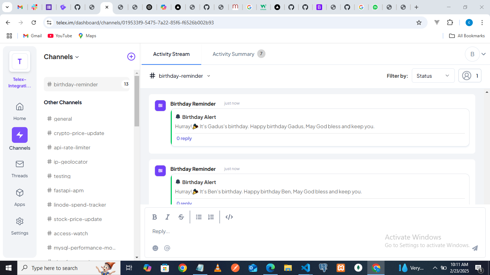

# Telex Birthday Reminder Integration

## 📌 Overview

The **Telex Birthday Reminder** is an integration that sends automated birthday reminders to a specified Telex channel. This ensures that team members never miss celebrating a colleague’s birthday.

## 🎯 Features

- Automatically checks for upcoming birthdays
- Sends reminders messages to a Telex channel.
- Runs at a specified interval using Telex's Interval Integration

## 🛠️ Setup Instructions

### 1️⃣ Prerequisites

- **Node.js** (v16 or later)
- **MongoDB Atlas** (or a local MongoDB instance)
- **Telex Account** (with a test channel)

### 2️⃣ Installation

```sh
# Clone the repository
git clone https://github.com/bensonate98/telex-birthday-reminder.git
cd telex-birthday-reminder

# Install dependencies
npm install
```

### 3️⃣ Configuration

1. **Create a **``** file** in the root directory and add the following:

```ini
PORT=3000
DB_URI=mongodb+srv://your-db-credentials
```

2. **Update **`` if needed.

### 4️⃣ Running the Integration Locally

```sh
npm run dev
```

Your server should now be running on `http://localhost:3000`.

### 5️⃣ Testing the Integration

#### ➤ Using Curl

```sh
curl --location 'http://localhost:3000/check-birthdays' \
--header 'Content-Type: application/json' \
--data '{
    "channel_id": "<your-telex-channel-id>",
    "return_url": "https://ping.telex.im/v1/return/<your-telex-channel-id>",
    "settings": [
        { "label": "interval", "type": "text", "required": true, "default": "0 6 * * *" }
    ]
}'
```

#### ➤ Using Postman

1. Open **Postman**
2. Create a `POST` request to `http://localhost:3000/check-birthdays`
3. Add the following JSON body:

```json
{
  "channel_id": "<your-telex-channel-id>",
  "return_url": "https://ping.telex.im/v1/return/<your-telex-channel-id>",
  "settings": [{ "label": "interval", "type": "text", "default": "0 6 * * *" }]
}
```

4. Click **Send** and check the response.

### 6️⃣ Deploying the Integration

#### ➤ Deploy to **Vercel**

```sh
vercel
```


### 7️⃣ Setting Up Telex Integration and Testing it online

1. Go to **Telex Dashboard** > **Apps**
2. Click **Add New**
3. Use `https://telex-birthday-reminder.vercel.app/integration.json` as the **JSON URL**
4. Go to settings and set the **interval** (e.g., `0 6 * * *` for daily 6AM reminders) or (e.g., `*/5 * * * *` for every 5 minutes incase you want it faster)
5. Save and activate the integration
6. Make sure every member of your team submit their names and birthdays using this link <https://birthday-saver.vercel.app/>
7. Please make sure you don't skip step 6 above. I advice you do that before any other thing. Telex needs those details to iterate and know when there's a birthday match
8. If all the above is properly done. Telex will check the database to see if there are any birthday match. If there are, Telex will send a message to the channel. Screenshots of telex-birthday reminder working are shown below: 

### 8️⃣ How to use Telex Birthday Reminder

Lolz.. I know I've told you before but I want it to stick😊
1. Ensure your team members fill in their names and birthdays using this link: <https://birthday-saver.vercel.app/>. Note: the birthdate must be in the format "YYY-MM-DD".
2. Activate Birthday Reminder on your channel and configure the set interval you prefer. Default is 6am, you can set it to every 5minutes to see its effect fast enough. Note the set interval must be set using cron-tab format.

## 📸 Screenshots

### 🎉 Birthday Reminder in Action




💡 *Feel free to contribute and improve this integration!* 🚀

